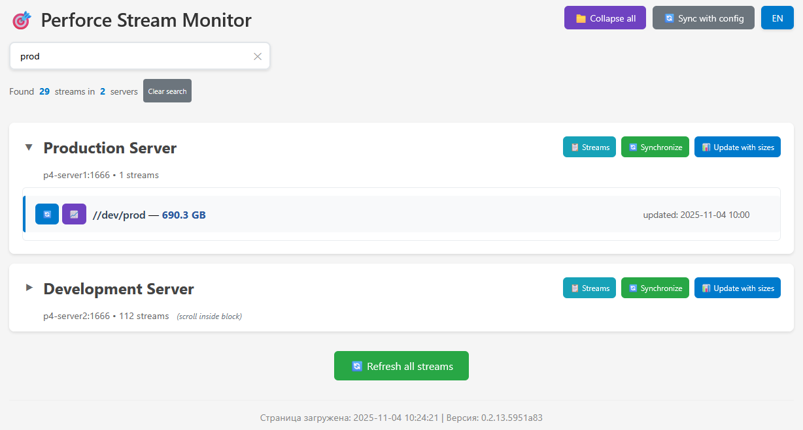

# P4 Stream Monitor

Веб-приложение для мониторинга размеров стримов Perforce с автоматическим обновлением и веб-интерфейсом.



## Возможности

- **Мультиязычный интерфейс** - поддержка русского и английского языков
- **Автоматическое определение языка** - на основе браузера и сохраненных предпочтений
- **Автоматический мониторинг** - фоновое обновление размеров стримов по расписанию
- **Мультисерверность** - поддержка нескольких серверов Perforce одновременно
- **Умные блокировки** - предотвращение конфликтов при параллельных операциях
- **Веб-интерфейс** - просмотр и управление через браузер
- **REST API** - набор API для интеграции и автоматизации
- **Гибкая конфигурация** - настройка через YAML-файлы
- **История изменений** - отслеживание динамики размеров стримов

## Структура проекта

```log
p4-stream-monitor/
├── app/
│   ├── config_utils.py     # Синхронизация серверов из YAML конфига
│   ├── lock_manager.py     # Менеджер блокировок для конфликтующих операций
│   ├── models.py           # Модели SQLAlchemy (Server, Stream, StreamHistory)
│   ├── p4_utils.py         # Утилиты для работы с Perforce (P4Python)
│   ├── scheduler.py        # Планировщик фоновых задач (APScheduler)
│   ├── utils.py            # Вспомогательные функции
│   └── views.py            # API endpoints и HTML рендеринг
├── config/
│   ├── servers.yaml        # Конфигурация серверов Perforce
│   ├── servers.yaml.example
│   └── settings.py         # Настройки приложения и планировщика
├── core/
│   └── logging.py          # Централизованная система логирования
├── static/
│   ├── css/                # Стили компонентов и основная тема
│   ├── js/                 # JavaScript для интерактивности
│   └── locales/            # Файлы переводов
├── templates/              # Jinja2 шаблоны
├── tools/
│   └── p4_auth.py          # Скрипт авторизации на серверах Perforce
├── instance/               # Базы данных SQLite
├── logs/                   # Файлы логов
├── .p4tickets              # Файл тикетов Perforce (создается tools/p4_auth.py)
├── .env.example            # Пример переменных окружения
├── requirements.txt        # Зависимости Python
├── run.py                  # Точка входа Flask приложения
└── VERSION                 # Версия приложения
```

## Быстрый старт

### 1. Установка и настройка

```bash
# Клонирование и настройка окружения
git clone https://git.thfree.ru/ThFree/p4-stream-monitor.git
cd p4-stream-monitor

# Создание виртуального окружения
sudo apt install python3-pip python3-venv

python3 -m venv .venv
source .venv/bin/activate  # Linux/Mac
# .venv\Scripts\activate   # Windows

# Установка зависимостей
pip install --upgrade pip
pip install -r requirements.txt
```

### 2. Конфигурация серверов

```bash
# Копируем пример конфигурации
cp config/servers.yaml.example config/servers.yaml

# Редактируем конфиг под свои сервера
nano config/servers.yaml
```

Пример `config/servers.yaml`:

```yaml
servers:
  - name: "Production Server"
    p4port: "p4-server1:1666"
    p4user: "p4monitor"
    stream_mask: "*role*"
    
  - name: "Development Server" 
    p4port: "p4-server2:1666"
    p4user: "p4monitor"
    stream_mask: "*dev*"
```

### 3. Авторизация в Perforce

```bash
# Запускаем скрипт авторизации
python tools/p4_auth.py

```

### 4. Запуск приложения

```bash
# Режим разработки
python run.py

# Или через Gunicorn (production)
gunicorn --bind 0.0.0.0:5000 run:app
```

Приложение будет доступно по адресу: `http://localhost:5000`

## Конфигурация

### Настройки приложения (`config/settings.py`)

```python
# Настройки планировщика
SCHEDULER = {
    "update_interval_hours": 6  # Интервал автообновления (часы)
}
```

### Переменные окружения (`.env`)

```bash
FLASK_ENV=production
```

## API Endpoints

### Endpoints управления обновлением

| Метод | Endpoint | Назначение | Блокировки |
|-------|----------|------------|------------|
| `POST` | `/api/update/all` | Обновить все стримы на всех серверах | Массовое обновление |
| `POST` | `/api/update/server/<id>` | Обновить стримы конкретного сервера | Обновление сервера |
| `POST` | `/api/update/stream/<id>` | Обновить размер конкретного стрима | Обновление стрима |
| `POST` | `/api/admin/sync-servers` | Синхронизировать серверы с конфигом | - |
| `POST` | `/api/update/server/<id>/sync-streams` | Синхронизировать список стримов (без расчета размеров) | Синхронизация сервера |

### Endpoints получения данных

| Метод | Endpoint | Назначение | Параметры |
|-------|----------|------------|-----------|
| `GET` | `/api/servers` | Получить список всех серверов | - |
| `GET` | `/api/server/<id>` | Получить информацию о конкретном сервере | - |
| `GET` | `/api/streams` | Получить список стримов с пагинацией | `page`, `per_page`, `server_id` |
| `GET` | `/api/stream/<id>` | Получить информацию о конкретном стриме | - |
| `GET` | `/api/server/<id>/streams` | Получить список стримов для сервера (без расчета размеров) | - |
| `GET` | `/api/streams/search` | Поиск стримов по имени | `q` |
| `GET` | `/api/stream/<id>/history` | Получить историю изменений размера стрима | `days`, `limit` |

### Endpoints мониторинга и статистики

| Метод | Endpoint | Назначение |
|-------|----------|------------|
| `GET` | `/api/stats` | Получить общую статистику по серверам и стримам |
| `GET` | `/api/info` | Получить информацию о приложении и версии |
| `GET` | `/api/status/locks` | Получить статус блокировок |
| `GET` | `/api/auth/check` | Проверить статус аутентификации Perforce |

### Примеры параметров запросов

**Для `/api/streams`:**

- `page` - номер страницы (по умолчанию: 1)
- `per_page` - количество элементов на странице (по умолчанию: 50)
- `server_id` - фильтр по ID сервера

**Для `/api/streams/search`:**

- `q` - поисковый запрос (минимум 2 символа)

**Для `/api/stream/<id>/history`:**

- `days` - период в днях (по умолчанию: 30)
- `limit` - максимальное количество записей (по умолчанию: 100)

### Особенности блокировок

- **Массовое обновление** блокирует все отдельные операции
- **Обновление сервера** блокирует операции с этим сервером
- **Обновление стрима** блокирует операции с этим стримом
- Статус блокировок можно проверить через `/api/status/locks`

## Production развертывание

### Gunicorn

```bash
gunicorn --bind 0.0.0.0:5000 \
         --workers 4 \
         --threads 2 \
         --timeout 120 \
         --access-logfile logs/access.log \
         --error-logfile logs/error.log \
         run:app
```

### Systemd сервис

```ini
# /etc/systemd/system/p4-monitor.service
[Unit]
Description=P4 Stream Monitor
After=network.target

[Service]
User=www-data
Group=www-data
WorkingDirectory=/opt/p4-stream-monitor
Environment=PATH=/opt/p4-stream-monitor/.venv/bin
ExecStart=/opt/p4-stream-monitor/.venv/bin/gunicorn --config config/gunicorn.conf.py run:app
Restart=always
RestartSec=5

# Security
NoNewPrivileges=yes
PrivateTmp=yes
ProtectSystem=strict
ProtectHome=yes
ReadWritePaths=/opt/p4-stream-monitor/logs /opt/p4-stream-monitor/instance

[Install]
WantedBy=multi-user.target
```

## 🛠️ Инструменты разработки

```bash
# Форматирование кода
isort --profile black .
black .

# Проверка качества
flake8 .
mypy .

# Запуск тестов (при наличии)
pytest
```

## Автоматизация

### Периодическое обновление через cron

```bash
# Каждые 6 часов
0 */6 * * * curl -X POST http://localhost:5000/api/update/all
```

### Мониторинг через health checks

```bash
# Проверка статуса приложения
curl -f http://localhost:5000/ > /dev/null
```

## Безопасность

- Блокировки предотвращают конфликтующие операции
- Аутентификация через P4 tickets
- Ограничение интерфейса в production режиме
- Валидация входных данных в API

## Troubleshooting

### Распространенные проблемы

1. **Файл тикетов не найден**

   ```bash
   python tools/p4_auth.py
   ```

2. **Серверы не синхронизированы**

   ```bash
   curl -X POST http://localhost:5000/api/admin/sync-servers
   ```

3. **Ошибки подключения к Perforce**

   - Проверить доступность серверов
   - Убедиться в правильности P4PORT/P4USER
   - Проверить срок действия тикетов

### Логи

- Основной лог: `logs/app.log`
- Access лог: `logs/access.log` (Gunicorn)
- Error лог: `logs/error.log` (Gunicorn)

## Лицензия

Проект распространяется под лицензией MIT. Подробнее см. в файле LICENSE.

---

**Примечание**: Для работы приложения необходим доступ к серверам Perforce и соответствующие права доступа для чтения стримов.
